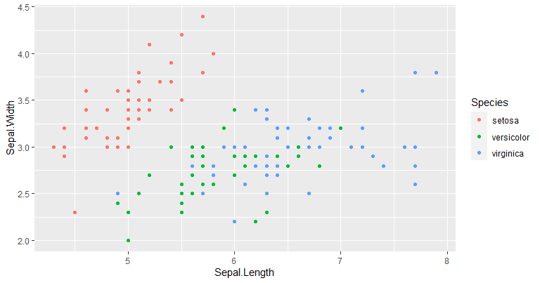

# section1

[印刷用ページ](?print-pdf)

[githubリポジトリ](https://github.com/bayashi-cl/revealjs-custom)

## Down the rabbit hole

Alice was beginning to get very tired of sitting by her sister on the bank, and of having nothing to do: once or twice she had peeped into the book her sister was reading, but it had no pictures or conversations in it, “and what is the use of a book,” thought Alice, “without pictures or conversations?”  
So she was considering, in her own mind (as well as she could, for the hot day made her feel very sleepy and stupid), whether the pleasure of making a daisy-chain would be worth the trouble of getting up and picking the daisies, when suddenly a White **Rabbit** with pink eyes ran close by her.

## 先生と私

　私は其人を常に**先生**と呼んでいた。だから此処でもただ先生と書く丈で本名は打ち明けない。是は世間を憚かる遠慮というよりも、其方が私にとって自然だからである。私は其人の記憶を呼び起すごとに、すぐ「先生」と云いたくなる。筆をとっても心得は同じ事である。余所々々しい頭文字抔はとても使う気にならない。  
　私が先生と知り合になったのは鎌倉である。其時私はまだ若々しい書生であった。暑中休暇を利用して海水浴に行った友達から是非来いという端書を受取ったので、私は多少の金を工面して、出掛る事にした。私は金に工面に二三日を費やした。所が私が鎌倉に着いて三日と経たないうちに、私を呼び寄せた友達は、急に国元から帰れと云う電報を受け取った。

## 数式

$$\int_{-\infty}^{\infty}e^{-ax^2}dx=\sqrt{\frac{\pi}{a}}$$

テキスト

## リスト

- リスト1
- リスト2
  * list1
  * list2

## 表

|    |Sepal.Length|Sepal.Width|Petal.Length|Petal.Width|Species|
|:---|-----------:|----------:|-----------:|----------:|------:|
|1   |         5.1|        3.5|         1.4|        0.2| setosa|
|2   |         4.9|        3.0|         1.4|        0.2| setosa|
|3   |         4.7|        3.2|         1.3|        0.2| setosa|
|4   |         4.6|        3.1|         1.5|        0.2| setosa|
|5   |         5.0|        3.6|         1.4|        0.2| setosa|
|6   |         5.4|        3.9|         1.7|        0.4| setosa|

## リンク

[リンク](https://en.wikipedia.org/wiki/Iris_flower_data_set)

## 画像


# section2

## スクリプトの出力


```{.r .numberLines}
summary(iris)
```

```
##   Sepal.Length    Sepal.Width     Petal.Length    Petal.Width   
##  Min.   :4.300   Min.   :2.000   Min.   :1.000   Min.   :0.100  
##  1st Qu.:5.100   1st Qu.:2.800   1st Qu.:1.600   1st Qu.:0.300  
##  Median :5.800   Median :3.000   Median :4.350   Median :1.300  
##  Mean   :5.843   Mean   :3.057   Mean   :3.758   Mean   :1.199  
##  3rd Qu.:6.400   3rd Qu.:3.300   3rd Qu.:5.100   3rd Qu.:1.800  
##  Max.   :7.900   Max.   :4.400   Max.   :6.900   Max.   :2.500  
##        Species  
##  setosa    :50  
##  versicolor:50  
##  virginica :50  
##                 
##                 
## 
```

## plotの貼り付け


```{.r .numberLines}
library(ggplot2)
ggplot(iris, aes(x = Sepal.Length, y = Sepal.Width,
                 color = Species)) +
  geom_point()
```


